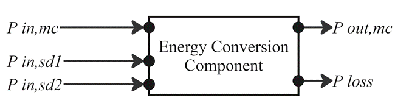
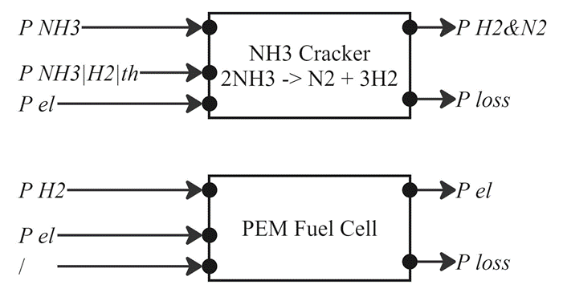
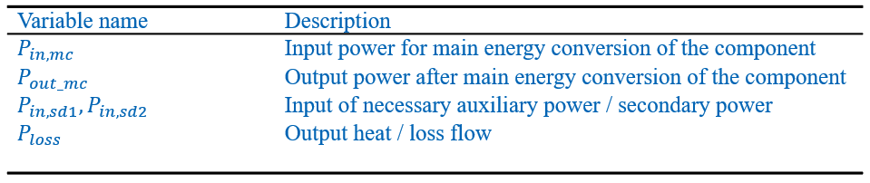
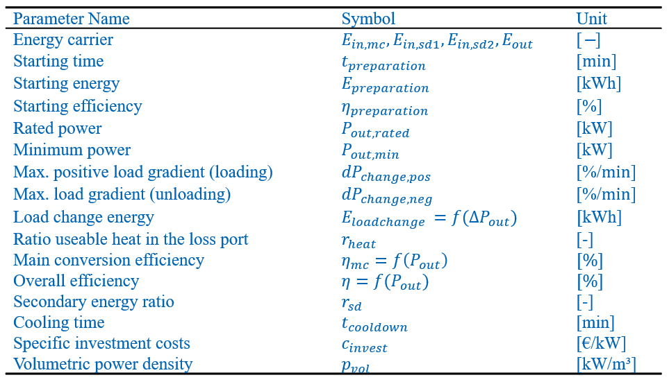
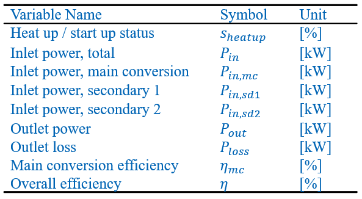
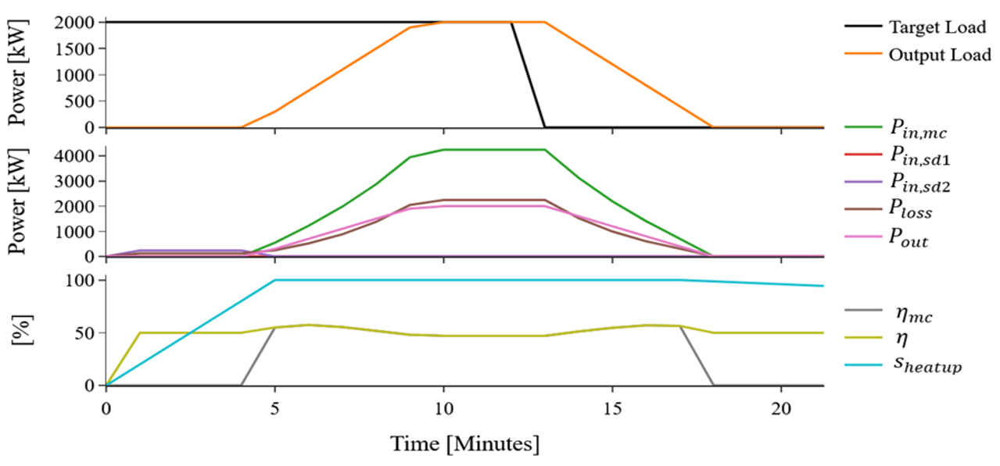
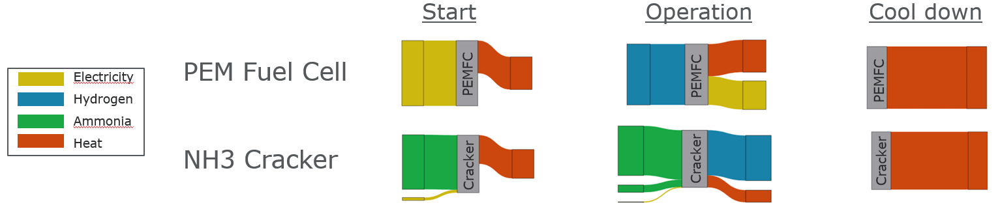

# energysys_components

## Description
Energy conversion component class with transient state change methods.

A Python-based simulation tool to analyse energy conversion systems in an early concept phase, where energy conversion components are described by technical and economic specifications in form of surrogate models. These models provide uniform, simplified descriptions of dynamic behaviour such as start-up, heat-up and load change in temporal and energetic terms. Exemplary components include fuel cells, batteries and gas reformers. 

Multiple different components can be linked via enthalpy flow to form a single dependent energy conversion path. A system can be comprised of several different paths.

System topology generation and control algorithms are published in:

https://github.com/ZBT-Tools/energysys_control

### Unified 0D Component Model
#### General Description

#### Examples

#### Input and output definition

#### Parameter definition

#### State definition

#### Example 

---

